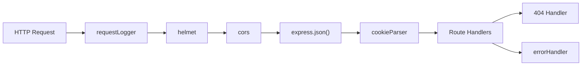
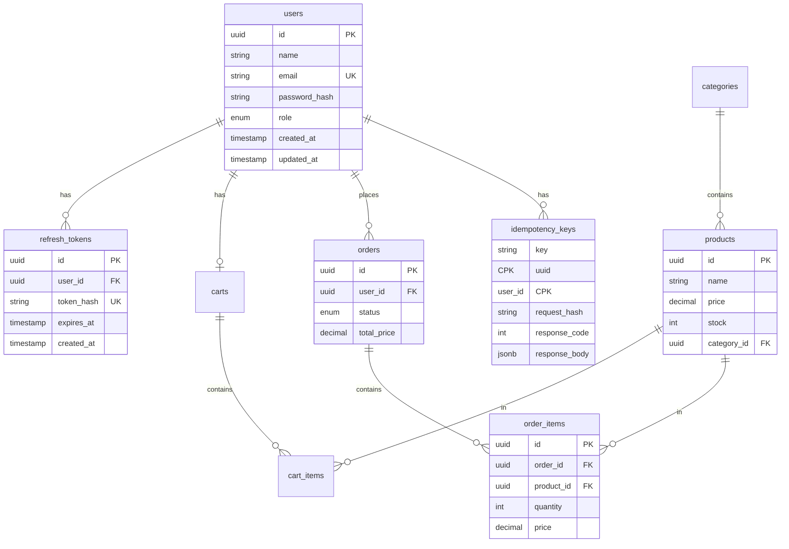
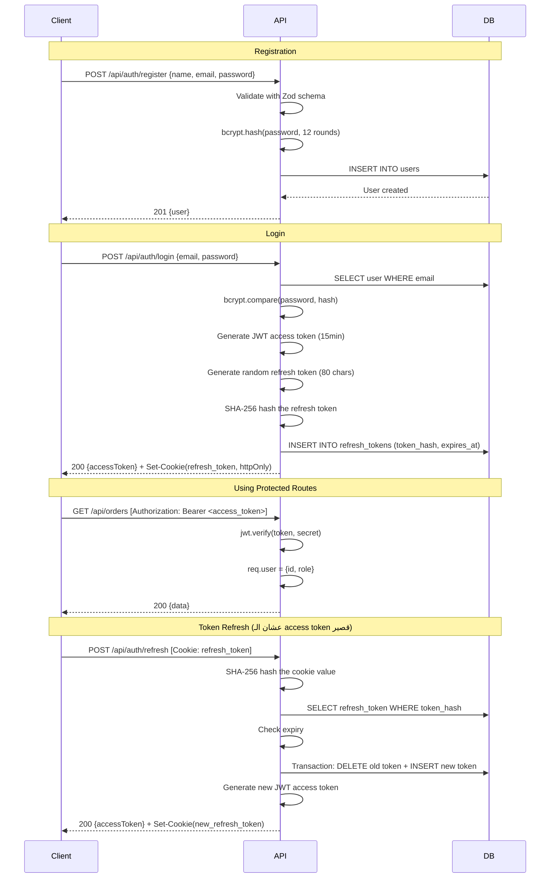
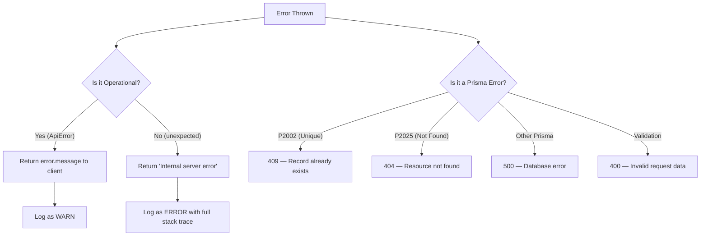
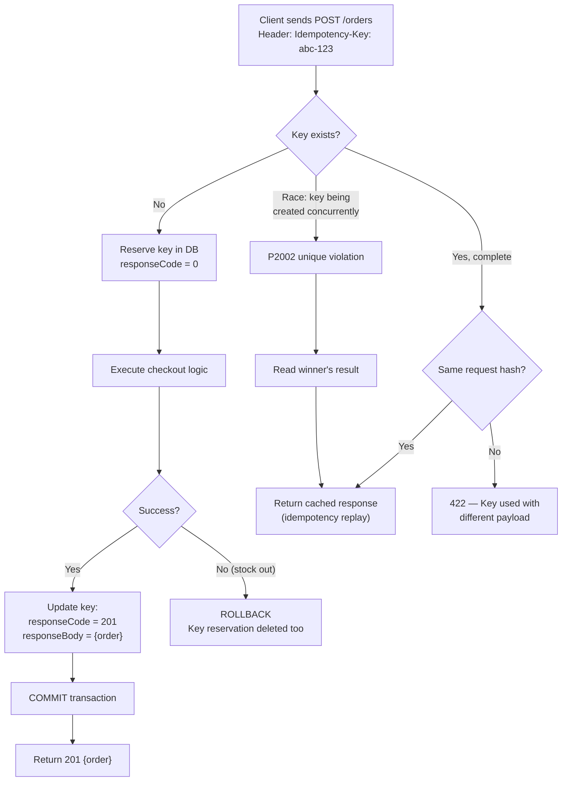

# 🏗️ ShopScale — Deep Dive: System Design في الـ Real World

> دليل تفصيلي لكل حاجة بنيناها في ShopScale — كأن سينيور قاعد يشرحلك كل قرار واحد واحد.

---

## 📖 جدول المحتويات

1. [نظرة عامة على المشروع](#1-نظرة-عامة-على-المشروع)
2. [الـ Architecture و Structure](#2-الـ-architecture-و-structure)
3. [الـ Database Design و Schema](#3-الـ-database-design-و-schema)
4. [الـ Authentication System (JWT + Refresh Tokens)](#4-الـ-authentication-system)
5. [الـ Authorization و Role-Based Access](#5-الـ-authorization-و-role-based-access)
6. [الـ Input Validation Layer (Zod)](#6-الـ-input-validation-layer)
7. [الـ Error Handling Strategy](#7-الـ-error-handling-strategy)
8. [الـ Concurrency Control و Race Conditions (V2)](#8-الـ-concurrency-control-و-race-conditions)
9. [الـ Idempotency Layer (V3)](#9-الـ-idempotency-layer)
10. [الـ Observability (Structured Logging)](#10-الـ-observability)
11. [الـ Security Hardening](#11-الـ-security-hardening)
12. [الـ Health Checks (Liveness + Readiness)](#12-الـ-health-checks)
13. [الـ Load Testing و Benchmarking](#13-الـ-load-testing-و-benchmarking)
14. [الـ Testing Strategy](#14-الـ-testing-strategy)
15. [ملخص الـ Trade-offs الكبيرة](#15-ملخص-الـ-trade-offs)

---

## 1. نظرة عامة على المشروع

**ShopScale** هو E-Commerce Backend API اتبنى مش عشان يكون مجرد CRUD — لا، اتبنى عشان **نطبّق عليه مفاهيم System Design حقيقية** وندرسها بالتجربة.

### الموضوعات اللي اتطبقت:

| الموضوع | الوصف |
|---|---|
| **Concurrency Control** | إزاي نمنع بيع منتج أكتر من المتاح لما يكون فيه ألف مستخدم بيطلبوا في نفس اللحظة |
| **Idempotency** | إزاي نضمن إن تكرار نفس الطلب مش هيعمل duplicate order |
| **Authentication & Token Rotation** | JWT access tokens + refresh token rotation |
| **Structured Logging & Observability** | Pino structured JSON logs مع request tracing |
| **Database Integrity** | CHECK constraints + atomic conditional updates |
| **Input Validation** | Schema validation في حدود الـ API |
| **Error Handling** | Operational vs Unexpected errors + Prisma safety net |
| **Health Checks** | Liveness + Readiness probes on Kubernetes/Docker style |
| **Load Testing** | k6 performance benchmarks |

### الـ Tech Stack:

```
Runtime:    Node.js
Framework:  Express.js
Database:   PostgreSQL 16 (via Docker)
ORM:        Prisma
Validation: Zod
Auth:       JWT (jsonwebtoken) + bcrypt
Logging:    Pino
Security:   Helmet + CORS + Rate Limiting
Testing:    Jest + Supertest
Load Test:  k6
```

---

## 2. الـ Architecture و Structure

### الـ Modular Architecture

```
src/
├── app.js                          # Express app composition
├── server.js                       # Entry point (HTTP server)
├── config/
│   └── env.js                      # Environment configuration
├── database/
│   └── prisma.js                   # Prisma client singleton
├── middleware/
│   ├── authenticate.js             # JWT verification
│   ├── authorize.js                # Role-based access
│   ├── errorHandler.js             # Global error handler
│   ├── requestLogger.js            # Request ID + structured logging
│   └── validate.js                 # Zod schema validation
├── modules/
│   ├── auth/                       # Authentication module
│   │   ├── auth.controller.js
│   │   ├── auth.routes.js
│   │   ├── auth.service.js
│   │   └── auth.validation.js
│   ├── health/                     # Health check module
│   │   ├── health.controller.js
│   │   └── health.routes.js
│   ├── orders/                     # Order/Checkout module
│   │   ├── order.controller.js
│   │   ├── order.routes.js
│   │   ├── order.service.js
│   │   └── order.validation.js
│   └── products/                   # Product catalog module
│       ├── product.controller.js
│       ├── product.routes.js
│       └── product.service.js
└── utils/
    ├── ApiError.js                 # Custom error class
    ├── catchAsync.js               # Async error wrapper
    ├── logger.js                   # Pino logger factory
    ├── parseDuration.js            # Duration string parser
    └── token.js                    # JWT + hashing utilities
```

### ليه اخترنا الـ Structure دي؟

#### Trade-off: Feature-based (Modular) vs Layer-based

| | Feature-based (اللي احنا اخترناه) | Layer-based |
|---|---|---|
| **Structure** | كل feature في folder واحد (routes + controller + service + validation) | كل layer في folder (all controllers together, all services together) |
| **Cohesion** | ✅ عالي — كل اللي يخص الـ orders مع بعض | ❌ منخفض — الـ order controller بعيد عن الـ order service |
| **Coupling** | ✅ منخفض — ممكن تشيل module كامل | ❌ عالي — كل layer تعتمد على التانية |
| **Scalability** | ✅ سهل تضيف features جديدة | ❌ كل feature يحتاج تعديل في 4 folders |
| **Navigation** | ✅ روح `modules/orders/` تلاقي كل حاجة | ❌ محتاج تقفز بين folders |

**القرار**: اخترنا **Feature-based** لأن في مشروع E-Commerce الـ modules بتكبر بسرعة. لما تيجي تشتغل على الـ "orders"، مش محتاج تدور في 5 folders — كل حاجة في مكان واحد.

### الـ Middleware Pipeline



#### الكود — [app.js](file:///c:/ssss/projects/ShopScale/src/app.js):

```javascript
const app = express();

// 1. Request logging — أول حاجة عشان نـ track كل request
app.use(requestLogger);

// 2. Security headers — Helmet بيضيف headers أمنية
app.use(helmet());

// 3. CORS — بيحدد مين يقدر يكلم الـ API
app.use(cors({ origin: env.cors.origin, credentials: true }));

// 4. Body parsing — بيحول JSON body لـ JavaScript object
app.use(express.json());

// 5. Cookie parsing — بيقرأ cookies (عشان refresh tokens)
app.use(cookieParser());

// 6. Rate limiting — بيحمي الـ auth routes من brute force
const authLimiter = rateLimit({
  windowMs: 15 * 60 * 1000, // 15 دقيقة
  max: env.nodeEnv === 'test' ? 10000 : 20,  // 20 محاولة فقط per IP
});

// Routes
app.use('/api/auth', authLimiter, authRoutes);
app.use('/api/products', productRoutes);
app.use('/api/orders', orderRoutes);
app.use('/health', healthRoutes);
```

> [!IMPORTANT]
> **ترتيب الـ middleware مهم جداً!** الـ `requestLogger` لازم يكون **أول حاجة** عشان يلحق يعمل assign لـ `requestId` قبل ما أي middleware تاني يـ log. والـ `errorHandler` لازم يكون **آخر حاجة** عشان يقدر يمسك أي error من أي middleware.

---

## 3. الـ Database Design و Schema

### الـ Entity-Relationship Diagram:



### الـ Schema في [schema.prisma](file:///c:/ssss/projects/ShopScale/prisma/schema.prisma):

#### Trade-off: UUID vs Auto-Increment Integer IDs

| | UUID (اللي احنا اخترناه) | Auto-Increment Integer |
|---|---|---|
| **Uniqueness** | ✅ عالمي — مفيش تعارض بين servers | ❌ محلي — لو عندك أكتر من database instance هتحتاج coordination |
| **Security** | ✅ مش ممكن تخمنه | ❌ ممكن حد يعمل `/users/1`, `/users/2`, `/users/3`... |
| **Performance** | ⚠️ أكبر في الحجم (36 chars) — index أبطأ قليلاً | ✅ أسرع في الـ indexing (4/8 bytes) |
| **Distributed Systems** | ✅ كل node يقدر يعمل generate بدون coordination | ❌ محتاج central sequence أو manual partitioning |

**ليه UUID؟** لأننا بنبني System مفروض يكون scalable. في distributed systems، لو عندك أكتر من instance بيكتبوا في databases مختلفة، UUIDs مش هتعمل conflict. كمان، مش عايزين user يقدر يعمل enumeration على الـ IDs.

#### الـ Naming Convention: `@@map`

```prisma
model User {
  id    String @id @default(uuid())
  name  String
  email String @unique
  passwordHash String @map("password_hash")  // JavaScript = camelCase, SQL = snake_case
  
  @@map("users")  // Table name = "users" مش "User"
}
```

**ليه؟** عشان كل لغة ليها convention:
- **JavaScript/Prisma**: `camelCase` → `passwordHash`, `createdAt`
- **PostgreSQL**: `snake_case` → `password_hash`, `created_at`

الـ `@map` بيسمحلنا نكتب clean code في الاتنين.

#### الـ CHECK Constraints — خط الدفاع الأخير

```sql
-- Migration: 20260928100732_add_stock_check_constraint
ALTER TABLE "products" ADD CONSTRAINT "products_stock_non_negative" CHECK ("stock" >= 0);
ALTER TABLE "cart_items" ADD CONSTRAINT "cart_items_quantity_positive" CHECK ("quantity" > 0);
ALTER TABLE "order_items" ADD CONSTRAINT "order_items_quantity_positive" CHECK ("quantity" > 0);
ALTER TABLE "order_items" ADD CONSTRAINT "order_items_price_non_negative" CHECK ("price" >= 0);
```

> [!CAUTION]
> **القاعدة الذهبية**: الـ application logic **ممكن يكون فيه bugs**. لكن الـ database constraint **أبدي**. حتى لو حد عمل manual SQL query أو فيه bug في الكود، المخزون مش هينزل تحت الصفر أبداً. دا اسمه **Defense in Depth**.

---

## 4. الـ Authentication System

### الـ Flow الكامل:



### الكود — [auth.service.js](file:///c:/ssss/projects/ShopScale/src/modules/auth/auth.service.js):

#### Registration:

```javascript
async function register({ name, email, password }) {
  // 1. Check if email already exists
  const existingUser = await prisma.user.findUnique({ where: { email } });
  if (existingUser) {
    throw new ApiError(409, 'Email already registered');
  }

  // 2. Hash the password (12 salt rounds)
  const passwordHash = await bcrypt.hash(password, SALT_ROUNDS);

  try {
    const user = await prisma.user.create({
      data: { name, email, passwordHash },
      select: { id: true, name: true, email: true, role: true, createdAt: true },
    });
    return user;
  } catch (error) {
    // 3. Race condition safety net!
    if (error.code === 'P2002') {
      throw new ApiError(409, 'Email already registered');
    }
    throw error;
  }
}
```

> [!NOTE]
> **لاحظ الـ double check**: بنعمل `findUnique` الأول (fast path عشان نرد error بسرعة)، بس بعدين بنمسك `P2002` (unique constraint violation) كمان لو اتنين users حاولوا يسجلوا بنفس الإيميل **في نفس الوقت**. دي نفس فكرة الـ TOCTOU اللي هنشرحها بالتفصيل في section الـ concurrency.

#### Trade-off: bcrypt Salt Rounds

| Rounds | Hash Time (approx) | Security |
|---|---|---|
| 10 | ~100ms | ✅ كافي لمعظم التطبيقات |
| **12 (اختيارنا)** | ~300ms | ✅ أفضل - OWASP recommended minimum |
| 14 | ~1s | ⚠️ بطيء — ممكن يأثر على UX |

**ليه 12؟** لأن OWASP بيوصي بـ minimum 10، واحنا عايزين نكون above minimum بدون ما نأثر على الـ latency بشكل كبير. كل round إضافي بيضاعف الوقت المطلوب لـ brute force attack.

#### Login + Token Strategy:

```javascript
async function login({ email, password }) {
  const user = await prisma.user.findUnique({ where: { email } });
  if (!user) {
    throw new ApiError(401, 'Invalid email or password');
    //  ^ مهم: نفس الرسالة سواء الإيميل غلط أو الباسورد!
    //    ليه؟ عشان المهاجم ميعرفش هل الإيميل دا مسجل ولا لأ (User Enumeration Prevention)
  }

  const passwordMatch = await bcrypt.compare(password, user.passwordHash);
  if (!passwordMatch) {
    throw new ApiError(401, 'Invalid email or password'); // نفس الرسالة!
  }

  // Access Token: قصير العمر (15 دقيقة) — يتبعت في JSON body
  const accessToken = generateAccessToken({ sub: user.id, role: user.role });
  
  // Refresh Token: طويل العمر (7 أيام) — يتخزن في httpOnly cookie
  const refreshToken = generateRefreshToken(); // 40 bytes random
  const tokenHash = hashToken(refreshToken);   // SHA-256 hash

  await prisma.refreshToken.create({
    data: { userId: user.id, tokenHash, expiresAt },
  });

  return { accessToken, refreshToken, user };
}
```

### Trade-off: JWT Access Token + Refresh Token vs Session-Based Auth

| | JWT + Refresh (اختيارنا) | Session-Based |
|---|---|---|
| **Stateless** | ✅ Access token = self-contained، مش محتاج database lookup كل request | ❌ كل request لازم يروح للـ session store |
| **Scalability** | ✅ أي server يقدر يتحقق من الـ token | ❌ محتاج sticky sessions أو shared session store (Redis) |
| **Revocation** | ⚠️ Access token مش بتتلغي (بس قصيرة العمر) | ✅ ممكن تلغي أي session فوراً |
| **Complexity** | ⚠️ محتاج refresh token rotation logic | ✅ أبسط في التنفيذ |
| **XSS Risk** | ⚠️ لو الـ access token اتسرق، صالح لـ 15 دقيقة | ⚠️ لو الـ session cookie اتسرق، صالح لحد ما تلغيه |

**ليه اخترنا JWT؟** لأن الهدف إننا نتعلم **stateless authentication** — في الـ microservices، كل service محتاجة تتحقق من الـ user بدون ما تروح لـ central database. الـ JWT بيحل المشكلة دي.

### Trade-off: ليه بنخزن الـ Refresh Token كـ Hash مش Plain Text؟

```javascript
// في token.js
function hashToken(token) {
  return crypto.createHash('sha256').update(token).digest('hex');
}
```

**السبب**: لو حد اخترق الـ database (SQL injection مثلاً)، هيلاقي hashes — مش الـ tokens الحقيقية. مش هيقدر يستخدمهم لأن SHA-256 هو one-way function.

### الـ Refresh Token Rotation:

```javascript
async function refresh(oldRefreshToken) {
  const tokenHash = hashToken(oldRefreshToken);
  
  const storedToken = await prisma.refreshToken.findUnique({
    where: { tokenHash },
    include: { user: true },
  });

  if (!storedToken) throw new ApiError(401, 'Invalid refresh token');
  if (storedToken.expiresAt < new Date()) {
    await prisma.refreshToken.delete({ where: { id: storedToken.id } });
    throw new ApiError(401, 'Refresh token expired');
  }

  // Token Rotation: حذف القديم + إنشاء جديد في TRANSACTION واحد
  const newRefreshToken = generateRefreshToken();
  const newTokenHash = hashToken(newRefreshToken);

  await prisma.$transaction([
    prisma.refreshToken.delete({ where: { id: storedToken.id } }),
    prisma.refreshToken.create({
      data: { userId: storedToken.userId, tokenHash: newTokenHash, expiresAt },
    }),
  ]);

  const accessToken = generateAccessToken({ sub: storedToken.user.id, role: storedToken.user.role });
  return { accessToken, refreshToken: newRefreshToken };
}
```

> [!TIP]
> **الـ Token Rotation** دا Pattern مهم جداً في الـ Security. الفكرة: كل ما تستخدم الـ refresh token، بتتلغي القديمة ويتعمل واحدة جديدة. لو مهاجم سرق الـ token القديم وحاول يستخدمه، هيلاقيه **متحذف** ← دا indicator إن فيه stolen token ← ممكن تعمل revocation لكل tokens الـ user.

### الـ Cookie Configuration — [auth.controller.js](file:///c:/ssss/projects/ShopScale/src/modules/auth/auth.controller.js):

```javascript
function setRefreshTokenCookie(res, refreshToken) {
  res.cookie('refresh_token', refreshToken, {
    httpOnly: true,     // ✅ JavaScript مش هيوصله (XSS protection)
    secure: env.nodeEnv === 'production',  // ✅ HTTPS only في production
    sameSite: 'strict', // ✅ مش هيتبعت مع cross-site requests (CSRF protection)
    path: '/api/auth',  // ✅ بيتبعت بس مع auth routes — مش كل request
    maxAge: parseDuration(env.refreshTokenExpiresIn), // 7 أيام
  });
}
```

---

## 5. الـ Authorization و Role-Based Access

### الكود — [authorize.js](file:///c:/ssss/projects/ShopScale/src/middleware/authorize.js):

```javascript
const authorize = (...roles) => {
  return (req, res, next) => {
    if (!req.user) {
      return next(new ApiError(401, 'Authentication required'));
    }
    if (!roles.includes(req.user.role)) {
      return next(new ApiError(403, 'Insufficient permissions'));
    }
    next();
  };
};

// الاستخدام:
router.delete('/products/:id', authenticate, authorize('ADMIN'), deleteProduct);
```

**ليه فصلنا `authenticate` عن `authorize`؟** → **Single Responsibility Principle**:
- `authenticate` → بيتحقق **مين أنت** (identity)
- `authorize` → بيتحقق **إيه صلاحياتك** (permissions)

الفصل دا بيخلينا نستخدم `authenticate` لوحده على routes مش محتاجة role check، ونضيف `authorize` بس لما يكون فيه role restrictions.

---

## 6. الـ Input Validation Layer

### Trade-off: Zod vs Joi vs Manual Validation

| | Zod (اختيارنا) | Joi | Manual if/else |
|---|---|---|---|
| **Type Safety** | ✅ TypeScript-first — schema = type | ⚠️ Runtime-only types | ❌ لا |
| **Bundle Size** | ✅ صغير (~13KB) | ❌ كبير (~150KB) | ✅ 0KB |
| **Error Messages** | ✅ واضحة و customizable | ✅ ممتازة | ❌ محتاج تكتبها يدوي |
| **Learning Curve** | ✅ بسيط وقريب من TypeScript | ⚠️ DSL خاص | ✅ مفيش |
| **Composability** | ✅ `.merge()`, `.extend()`, `.pick()` | ⚠️ محدود | ❌ صعب |

### الكود — [auth.validation.js](file:///c:/ssss/projects/ShopScale/src/modules/auth/auth.validation.js):

```javascript
const registerSchema = z.object({
  name: z.string()
    .trim()                              // بيشيل spaces
    .min(2, 'Name must be at least 2 characters')
    .max(100),
  email: z.string()
    .trim()
    .email('Invalid email address')
    .toLowerCase(),                      // بيحول لـ lowercase عشان uniqueness
  password: z.string()
    .min(8, 'Password must be at least 8 characters')
    .max(128),                           // max مهم عشان bcrypt عنده limit
});
```

> [!NOTE]
> **ليه `.max(128)` على الـ password؟** bcrypt عنده hard limit عند 72 bytes. بس بنحط 128 عشان UX أحسن — المستخدم مش هيحس إنه restricted. الـ bcrypt هيعمل hash لأول 72 byte بس، وهيكون آمن.

### الـ Middleware Pattern — [validate.js](file:///c:/ssss/projects/ShopScale/src/middleware/validate.js):

```javascript
const validate = (schema) => (req, res, next) => {
  const result = schema.safeParse(req.body);
  
  if (!result.success) {
    const errors = result.error.issues.map((issue) => ({
      field: issue.path.join('.'),    // "items.0.productId"
      message: issue.message,         // "Invalid product ID"
    }));
    const error = new ApiError(400, 'Validation failed');
    error.errors = errors;
    return next(error);
  }

  req.body = result.data;  // ← مهم جداً! بيستبدل الـ body بالـ parsed data
  next();
};
```

> [!IMPORTANT]
> **`req.body = result.data`** دي نقطة مهمة. Zod مش بس بيـ validate — كمان بيـ **transform** (مثلاً `trim()` و `toLowerCase()`). لما بنستبدل الـ `req.body`، بنضمن إن الـ service layer بيشتغل مع **clean, validated data**. كمان أي extra fields مش موجودة في الـ schema هتتشال (stripping unknown fields).

---

## 7. الـ Error Handling Strategy

### الفلسفة: Operational vs Unexpected Errors



### الكود — [ApiError.js](file:///c:/ssss/projects/ShopScale/src/utils/ApiError.js):

```javascript
class ApiError extends Error {
  constructor(statusCode, message) {
    super(message);
    this.statusCode = statusCode;
    this.isOperational = true;  // ← هنا الفرق!
    Error.captureStackTrace(this, this.constructor);
  }
}
```

**`isOperational = true`** معناها: "أنا عارف الـ error دا — هو expected ومش bug."

- **Operational**: المستخدم بعت data غلط، مش authenticated، stock مش كافي → رد بـ message واضح
- **Unexpected**: TypeError, null reference, database connection down → **عمرك ما تسرب تفاصيل للـ client!** قوله "Internal server error" بس.

### الـ Error Handler — [errorHandler.js](file:///c:/ssss/projects/ShopScale/src/modules/../middleware/errorHandler.js):

```javascript
const errorHandler = (err, req, res, next) => {
  // 1. Prisma Safety Net — بيمسك أي Prisma error الـ service نسي يعالجه
  if (err instanceof Prisma.PrismaClientKnownRequestError) {
    switch (err.code) {
      case 'P2002':
        return res.status(409).json({
          status: 'error',
          message: 'A record with this value already exists',
          // في development بس: بيقولك إيه الـ field
          ...(env.nodeEnv === 'development' && { field: err.meta?.target?.join(', ') }),
        });
      case 'P2025':
        return res.status(404).json({ status: 'error', message: 'Resource not found' });
      default:
        return res.status(500).json({ status: 'error', message: 'A database error occurred' });
    }
  }

  // 2. Operational vs Unexpected
  const statusCode = err.statusCode || 500;
  const message = err.isOperational ? err.message : 'Internal server error';
  
  // 3. Stack trace في development بس
  res.status(statusCode).json({
    status: 'error',
    message,
    ...(env.nodeEnv === 'development' && !err.isOperational && { stack: err.stack }),
  });
};
```

> [!WARNING]
> **لاحظ**: في production، الـ client عمره ما بيشوف stack traces أو database error details. دا مش بس UX — دا **security**. الـ stack trace ممكن يسرب internal file paths, library versions, database column names... كل دا بيساعد المهاجم.

### الـ catchAsync Utility — [catchAsync.js](file:///c:/ssss/projects/ShopScale/src/utils/catchAsync.js):

```javascript
const catchAsync = (fn) => (req, res, next) => {
  Promise.resolve(fn(req, res, next)).catch(next);
};
```

**المشكلة اللي بيحلها**: Express مش بيعمل catch لـ async errors تلقائياً! لو عندك `async` route handler وعمل throw:

```javascript
// ❌ بدون catchAsync — الـ error بيتسرب والـ server بيعلق
router.get('/', async (req, res) => {
  const products = await productService.list(); // لو throw هنا ← unhandled!
});

// ✅ مع catchAsync — الـ error بيتبعت للـ errorHandler
router.get('/', catchAsync(async (req, res) => {
  const products = await productService.list(); // لو throw ← next(err) ← errorHandler
}));
```

---

## 8. الـ Concurrency Control و Race Conditions

> [!CAUTION]
> **دي أهم section في المشروع كله.** لو مفهمتش حاجة واحدة بس، يكون الـ section دا.

### المشكلة: الـ Overselling Bug

تخيل إن عندك **منتج واحد في المخزون** (stock = 1) و **100 مستخدم** بيطلبوه **في نفس الثانية**.

#### الكود القديم (V1 — المكسور):

```javascript
// Step 1: اقرأ الـ stock (بره الـ transaction!)
const products = await prisma.product.findMany({ where: { id: { in: productIds } } });

// Step 2: اتحقق في الـ memory (بيانات قديمة ممكن!)
for (const item of items) {
  if (product.stock < item.quantity) {
    throw new ApiError(400, 'Insufficient stock');
  }
}

// Step 3: اعمل UPDATE (من غير شرط على الـ stock!)
await prisma.$transaction(async (tx) => {
  for (const item of items) {
    await tx.product.update({
      where: { id: item.productId },
      data: { stock: { decrement: item.quantity } },
      // ↑ دا بيتحول لـ: UPDATE products SET stock = stock - 1 WHERE id = $id
      //   من غير ما يتحقق هل stock >= 1 أصلاً!
    });
  }
});
```

### الـ Race Condition Visualized:

```
الوقت →
────────────────────────────────────────────────────────────────

Request A:  SELECT stock → يقرأ 1 ✓
                                    CHECK: 1 >= 1 ← PASS ✓
                                                        UPDATE stock = stock - 1 (0) ✅
                                                        INSERT order → COMMIT ✅

Request B:  SELECT stock → يقرأ 1 ✓  (قرأ نفس القيمة!)
                                    CHECK: 1 >= 1 ← PASS ✓  (قرار غلط!)
                                                        UPDATE stock = stock - 1 (-1) 💀
                                                        INSERT order → COMMIT 💀
```

**النتيجة**: اتباع **2 orders** بدل 1! والـ stock بقى **-1**! 💀

### الـ Experiment — اثبتنا المشكلة بالأرقام:

| Concurrent Users | Orders Created | Stock النهائي | Over-sold |
|:---:|:---:|:---:|:---:|
| 2 | 2 | -1 | +1 ❌ |
| 5 | 5 | -4 | +4 ❌ |
| 10 | 7 | -6 | +6 ❌ |
| 50 | 25 | -24 | +24 ❌ |
| 100 | 50 | -49 | +49 ❌ |

### الحلول المرشحة:

| الحل | الفكرة | الحكم |
|---|---|---|
| **1. Naive Read-Then-Write** | اقرأ في الـ memory واتحقق | ❌ مكسور تماماً (TOCTOU) |
| **2. Atomic Conditional UPDATE** ✅ | `WHERE stock >= qty` في الـ UPDATE نفسه | ✅ **اخترناه** — بسيط وقوي |
| **3. SELECT FOR UPDATE** | قفل الصف قبل ما تقرأه | ⚠️ أعقد من اللازم + deadlock risk |
| **4. Serializable Isolation** | خلي PostgreSQL يكتشف conflicts | ❌ Overkill — محتاج retry logic |
| **5. CHECK Constraint** | `CHECK (stock >= 0)` | ✅ **أضفناه** كـ safety net |

### الكود الجديد (V2 — الآمن) — [order.service.js](file:///c:/ssss/projects/ShopScale/src/modules/orders/order.service.js):

```javascript
// 1. رتب الـ items بالترتيب الأبجدي عشان نمنع deadlocks
const sortedItems = [...items].sort((a, b) => 
  a.productId.localeCompare(b.productId)
);

return await prisma.$transaction(async (tx) => {
  // 2. اقرأ المنتجات جوه الـ transaction
  const products = await tx.product.findMany({
    where: { id: { in: productIds } },
  });

  // 3. Atomic Conditional UPDATE — هنا السحر!
  for (const item of sortedItems) {
    const updateResult = await tx.product.updateMany({
      where: {
        id: item.productId,
        stock: { gte: item.quantity },  // ← الشرط الذري!
        // ↑ دا بيتحول لـ:
        // UPDATE products SET stock = stock - 1
        // WHERE id = $id AND stock >= 1
        // لو الشرط مش متحقق → 0 rows updated
      },
      data: { stock: { decrement: item.quantity } },
    });

    // لو ما عدلناش أي row → يبقى الـ stock خلص!
    if (updateResult.count === 0) {
      throw new ApiError(400, `Insufficient stock for product: ${product.name}`);
      // ↑ الـ throw بيعمل rollback لكل الـ transaction
    }
  }

  // 4. كل حاجة تمام → اعمل الـ order
  return tx.order.create({ ... });
});
```

### إزاي الحل دا بيشتغل:

```
الوقت →
────────────────────────────────────────────────────────────────

Request A:  BEGIN TX
            UPDATE products SET stock = stock - 1
              WHERE id = $id AND stock >= 1
            → PostgreSQL يقفل الصف ← stock becomes 0
            INSERT order
            COMMIT ← Row lock released ✅

Request B:  BEGIN TX
            UPDATE products SET stock = stock - 1
              WHERE id = $id AND stock >= 1
            → ينتظر لحد ما Request A يعمل COMMIT...
            → الآن stock = 0... AND 0 >= 1? → FALSE!
            → 0 rows updated!
            → count === 0 → throw ApiError(400)
            ROLLBACK ← ❌ مفيش order اتعمل
```

### النتيجة بعد الإصلاح:

| Concurrent Users | Orders Created | Stock النهائي | Over-sold |
|:---:|:---:|:---:|:---:|
| 2 | **1** | **0** | **0** ✅ |
| 5 | **1** | **0** | **0** ✅ |
| 10 | **1** | **0** | **0** ✅ |
| 50 | **1** | **0** | **0** ✅ |
| 100 | **1** | **0** | **0** ✅ |

### ليه بنرتب الـ Items؟ (Deadlock Prevention)

```javascript
const sortedItems = [...items].sort((a, b) => 
  a.productId.localeCompare(b.productId)
);
```

بدون ترتيب:
```
Request A: Lock Product-X → waiting for Product-Y (locked by B) ← DEADLOCK! 💀
Request B: Lock Product-Y → waiting for Product-X (locked by A) ← DEADLOCK! 💀
```

مع ترتيب:
```
Request A: Lock Product-X → Lock Product-Y → COMMIT ✅
Request B: waiting for Product-X... → (A finished) → Lock Product-X → Lock Product-Y → COMMIT ✅
```

> [!TIP]
> **القاعدة**: لو هتعمل lock على أكتر من resource واحد، **رتبهم بنفس الترتيب دايماً**. كدا أي transaction هتقفل بنفس الترتيب ← مفيش circular wait ← مفيش deadlock.

---

## 9. الـ Idempotency Layer

### المشكلة: الـ Double-Submit

المستخدم ضغط "Buy" وبعدين ضغط تاني قبل ما الأولى تخلص. أو الـ network عمل retry. أو الـ mobile app بعت الطلب مرتين.

بدون idempotency: **هيتعمل 2 orders!** 💸

### الحل: Idempotency Key



### الكود بالتفصيل — [order.service.js](file:///c:/ssss/projects/ShopScale/src/modules/orders/order.service.js):

#### Step 1: Request Hash (تحديد هوية الطلب)

```javascript
function computeRequestHash(items) {
  // Normalize: خد بس الـ fields اللي مهمة
  const normalized = items.map((item) => ({
    productId: item.productId,
    quantity: item.quantity,
  }));

  // Sort: عشان نفس الـ items بترتيب مختلف يطلعوا نفس الـ hash
  normalized.sort((a, b) => a.productId.localeCompare(b.productId));

  const canonical = JSON.stringify(normalized);
  return crypto.createHash('sha256').update(canonical).digest('hex');
}
```

**ليه hash الـ request مش نخزن الـ items كـ JSON؟**
1. الـ JSON ممكن يكون كبير ← الـ hash حجمه ثابت (64 chars)
2. المقارنة أسرع (string comparison بدل deep object comparison)
3. بيحل مشكلة ترتيب الـ keys في JSON

#### Step 2: الـ Flow الكامل

```javascript
async function createOrder(userId, items, idempotencyKey) {
  const requestHash = computeRequestHash(items);

  // ═══════════════════════════════════════════════════
  // Phase 1: Fast Path — هل الـ key دا اتنفذ قبل كدا؟
  // ═══════════════════════════════════════════════════
  const existing = await prisma.idempotencyKey.findUnique({
    where: { key_userId: { key: idempotencyKey, userId } },
  });

  if (existing && existing.responseCode !== 0) {
    // الـ key موجود ومكتمل!
    if (existing.requestHash !== requestHash) {
      // ❌ نفس الـ key بس payload مختلف!
      throw new ApiError(422, 
        'Idempotency key has already been used with a different request payload');
    }
    // ✅ نفس الـ key ونفس الـ payload → ارجع الـ response المخزن
    return {
      cached: true,
      outcome: 'idempotency_replay',
      responseCode: existing.responseCode,
      responseBody: existing.responseBody,
    };
  }

  // ═══════════════════════════════════════════════════
  // Phase 2: Transactional Execution
  // ═══════════════════════════════════════════════════
  try {
    return await prisma.$transaction(async (tx) => {
      // Step 0: احجز الـ key (INSERT) — لو حد تاني حجزه → P2002 error
      await tx.idempotencyKey.create({
        data: {
          key: idempotencyKey, userId, requestHash,
          responseCode: 0,      // ← "in progress"
          responseBody: {},
        },
      });

      // Step 1-4: نفس الـ V2 checkout logic (sort + atomic update + create order)
      // ...

      // Step 5: احفظ النتيجة في الـ idempotency key
      await tx.idempotencyKey.update({
        where: { key_userId: { key: idempotencyKey, userId } },
        data: { responseCode: 201, responseBody },
      });

      return { cached: false, outcome: 'completed', responseCode: 201, responseBody };
    });
  } catch (err) {
    // ═══════════════════════════════════════════════════
    // Phase 3: Race Condition Handler
    // ═══════════════════════════════════════════════════
    if (isIdempotencyKeyConflict(err)) {
      // Request B حاول يحجز نفس الـ key — بس Request A سبقه!
      // استنى وبعدين اقرأ النتيجة بتاعت A
      const completed = await prisma.idempotencyKey.findUnique({
        where: { key_userId: { key: idempotencyKey, userId } },
      });

      if (completed && completed.responseCode !== 0) {
        return {
          cached: true,
          outcome: 'idempotency_replay',
          responseCode: completed.responseCode,
          responseBody: completed.responseBody,
        };
      }
    }
    throw err;
  }
}
```

### Trade-off: Database-Based Idempotency vs Redis-Based

| | Database (اختيارنا) | Redis |
|---|---|---|
| **Durability** | ✅ الـ data متخزنة على disk — مش هتضيع لو restart | ⚠️ ممكن تضيع لو Redis عمل restart (بيعتمد على persistence config) |
| **Atomicity with Business Logic** | ✅ الـ idempotency key والـ order في **نفس الـ transaction** — يا هيـ commit الاتنين يا مش هيـ commit أي حاجة | ❌ محتاج two-phase coordination — ممكن الـ Redis يسجل بس الـ DB ميسجلش |
| **Performance** | ⚠️ أبطأ — disk I/O | ✅ أسرع — in-memory |
| **TTL** | ⚠️ محتاج cron job لحذف الـ keys القديمة | ✅ Redis TTL built-in |
| **Extra Infrastructure** | ✅ مفيش — بنستخدم نفس الـ PostgreSQL | ❌ محتاج Redis server |

**ليه اخترنا Database؟** لأن الـ **atomicity** هي الأهم. لو استخدمنا Redis، ممكن يحصل:
1. Redis يسجل الـ key
2. الـ database transaction يفشل
3. دلوقتي الـ key موجود في Redis بس الـ order ما اتعملش!

مع الـ database approach: لو الـ transaction فشلت → الـ key reservation بتتلغي تلقائياً (ROLLBACK).

### Trade-off: ليه `responseCode = 0` مش `NULL`؟

عشان `0` هو HTTP status code مش valid — بنستخدمه كـ **sentinel value** يقول "الـ transaction لسه شغالة". لو حد قرأ الـ key ولقى `responseCode = 0`، يعرف إن فيه transaction in progress.

---

## 10. الـ Observability

### الـ Structured Logging مع Pino

#### Trade-off: Pino vs Winston vs Morgan

| | Pino (اختيارنا) | Winston | Morgan |
|---|---|---|---|
| **Performance** | ✅ الأسرع — 5x-10x أسرع من Winston | ⚠️ أبطأ بكتير | ✅ خفيف بس HTTP-only |
| **Output** | JSON (structured) | Flexible (JSON, text, etc.) | Text only |
| **Features** | ✅ Redaction, child loggers | ✅ Full-featured | ❌ Basic |
| **Ecosystem** | ✅ pino-pretty, pino-elasticsearch | ✅ Many transports | ❌ محدود |

### الـ Request Logger — [requestLogger.js](file:///c:/ssss/projects/ShopScale/src/middleware/requestLogger.js):

```javascript
function requestLogger(req, res, next) {
  // 1. Generate أو استخدم request ID
  const requestId = getOrGenerateRequestId(req);  // من header أو random UUID
  
  // 2. خزن الـ request ID
  req.requestId = requestId;
  res.setHeader('X-Request-ID', requestId);
  
  // 3. اعمل child logger مع الـ requestId embedded
  req.log = logger.child({ requestId });
  // ↑ كل log message من هنا لقدام هتشيل الـ requestId تلقائي!

  // 4. لما الـ response يخلص — سجّل
  res.on('finish', () => {
    const durationMs = /* high-resolution timer */;
    req.log.info({
      method: req.method,
      path: '/api/orders',
      statusCode: 201,
      durationMs: 45.23,
      userId: 'abc-123',
    }, 'HTTP request completed');
  });
}
```

### الـ Output بيكون كدا:

```json
{
  "level": 30,
  "time": 1727525432100,
  "requestId": "a8f2c4e1-3b7d-4f12-9abc-def012345678",
  "method": "POST",
  "path": "/api/orders",
  "statusCode": 201,
  "durationMs": 45.23,
  "userId": "user-uuid-here",
  "msg": "HTTP request completed"
}
```

**ليه Structured JSON مش text logs؟**
1. **Searchable**: ممكن تعمل `jq '.statusCode == 500'` أو تبعتها لـ Elasticsearch
2. **Parseable**: أي log aggregation tool (ELK, Datadog, Grafana) بيفهم JSON
3. **Contextual**: كل log line فيها كل الـ context اللي محتاجها — requestId, userId, duration

### الـ Sensitive Data Redaction — [logger.js](file:///c:/ssss/projects/ShopScale/src/utils/logger.js):

```javascript
const SENSITIVE_PATHS = [
  'password', '*.password',
  'token', '*.token',
  'accessToken', '*.accessToken',
  'refreshToken', '*.refreshToken',
  'authorization', 'headers.authorization',
  'cookie', 'headers.cookie',
  'DATABASE_URL', '*.DATABASE_URL',
  'secret', '*.secret',
  'apiKey', '*.apiKey',
];

const logger = pino({
  redact: {
    paths: SENSITIVE_PATHS,
    censor: '[REDACTED]',
  },
});
```

> [!CAUTION]
> **أي حاجة حساسة بتتحول لـ `[REDACTED]` أوتوماتيك.** لو بالغلط عملت `logger.info({ password: '123456' })` ← هيظهر في الـ logs كـ `{ password: '[REDACTED]' }`. دا بيمنع **accidental credential leakage** في الـ logs.

### الـ Log Stream Architecture (for Testing):

```javascript
const logStream = new PassThrough();
logStream.resume();

if (process.env.NODE_ENV !== 'test') {
  logStream.pipe(process.stdout);  // في development/production بس
}

// في tests — ممكن نمسك الـ logs ونتحقق منها:
function captureLogs() {
  const captured = [];
  const listener = (chunk) => {
    captured.push(JSON.parse(chunk.toString().trim()));
  };
  logStream.on('data', listener);
  return {
    logs: captured,           // Array of parsed log objects
    release: () => logStream.off('data', listener),
  };
}
```

**ليه؟** عشان نقدر نعمل test على الـ logs نفسها! مثلاً: "هل لما المستخدم يعمل login، الـ log بيسجل الـ event صح؟ هل الـ password مش موجود في الـ log؟"

---

## 11. الـ Security Hardening

### الـ Layers:

```
Layer 1: Helmet      → Security Headers (XSS, clickjacking, MIME sniffing)
Layer 2: CORS        → Cross-Origin Request Control
Layer 3: Rate Limit  → Brute Force Protection
Layer 4: Auth        → JWT Verification
Layer 5: Input Valid  → Injection Prevention (Zod)
Layer 6: Redaction   → Log Sanitization
Layer 7: Cookie Sec  → httpOnly, secure, sameSite, path-scoped
```

#### Rate Limiting على الـ Auth Routes:

```javascript
const authLimiter = rateLimit({
  windowMs: 15 * 60 * 1000,  // 15 minutes window
  max: env.nodeEnv === 'test' ? 10000 : 20,  // 20 attempts per 15min in prod
  message: { status: 'error', message: 'Too many requests, please try again later' },
});

app.use('/api/auth', authLimiter, authRoutes);
```

**ليه 20 بس؟** لأن الـ auth routes فيها `bcrypt.compare` — عملية **غالية computationally**. لو سمحت بـ unlimited requests:
1. **Brute force attack**: حد يحاول يخمن passwords
2. **DoS**: الـ CPU هيشتغل non-stop على bcrypt hashing

**ليه `10000` في test mode؟** عشان integration tests بتعمل مئات الـ requests في ثواني — مش عايزين الـ rate limiter يمنعها.

---

## 12. الـ Health Checks

### Trade-off: Liveness vs Readiness

| | Liveness (`/health/live`) | Readiness (`/health/ready`) |
|---|---|---|
| **الهدف** | هل الـ process لسه شغال؟ | هل الـ service جاهز يخدم requests؟ |
| **بيتحقق من** | لا حاجة — لو رد يبقى شغال | Database connection |
| **لو فشل** | Kubernetes يعمل restart للـ container | Kubernetes يشيل الـ pod من الـ load balancer |
| **يجب أن يكون** | دائماً ناجح (ما لم الـ process يموت) | ممكن يفشل (database down) |

### الكود — [health.controller.js](file:///c:/ssss/projects/ShopScale/src/modules/health/health.controller.js):

```javascript
// Liveness — بسيط جداً
const liveness = (req, res) => {
  res.status(200).json({ status: 'ok' });
  // لو الـ process قادر يرد ← يبقى alive
};

// Readiness — بيتحقق من الـ Database
const readiness = async (req, res) => {
  try {
    await checkDatabase();  // SELECT 1 مع timeout
    res.status(200).json({ status: 'ok', database: 'connected' });
  } catch (err) {
    res.status(503).json({ status: 'error', message: 'Service unavailable' });
    // 503 = Service Unavailable → شيلني من الـ load balancer!
  }
};
```

#### الـ Database Check مع Timeout:

```javascript
async function checkDatabase(timeoutMs = getTimeoutMs()) {
  let timer;
  const timeoutPromise = new Promise((_, reject) => {
    timer = setTimeout(() => {
      const err = new Error(`Database health check timed out after ${timeoutMs}ms`);
      err.code = 'ETIMEDOUT';
      reject(err);
    }, timeoutMs);
  });

  try {
    await Promise.race([
      prisma.$queryRaw`SELECT 1`,
      timeoutPromise,
    ]);
  } finally {
    clearTimeout(timer);
  }
}
```

> [!NOTE]
> **الـ `Promise.race` دا pattern مهم**: بنحط race بين الـ database query والـ timeout. أول واحد يخلص يكسب. لو الـ database بطيء ← الـ timeout بيكسب ← readiness = failed ← Kubernetes يشيل الـ pod من traffic.

> [!WARNING]
> **لاحظ التعليق في الكود**: `Promise.race` بيوقف **الانتظار** بس — الـ Prisma query لسه شغالة في الخلفية وماسكة pool connection! دا trade-off مقبول لأن الـ health check بيتعمل كل كام ثانية مش كل request.

---

## 13. الـ Load Testing و Benchmarking

### الـ k6 Test Scripts

بنستخدم **k6** (من Grafana Labs) — أقوى أداة load testing:

```javascript
// tests/load/orders.js — k6 script
export const options = {
  stages: [
    { duration: '10s', target: 3 },   // Ramp up: من 0 لـ 3 VUs في 10 ثواني
    { duration: '25s', target: 6 },   // Sustain: 6 VUs لمدة 25 ثانية
    { duration: '10s', target: 0 },   // Ramp down: من 6 لـ 0 في 10 ثواني
  ],
  thresholds: {
    http_req_failed: ['rate<0.01'],     // أقل من 1% errors
    http_req_duration: ['p(95)<600'],   // 95% من الـ requests تحت 600ms
  },
};
```

### الـ Seed Script — [seed.js](file:///c:/ssss/projects/ShopScale/tests/load/seed.js):

بيعمل setup لـ:
- Benchmark user (password already hashed)
- Target product مع `stock = 1,000,000` (عشان الـ load test ميخلصش الـ stock)
- 23 catalog items (عشان pagination testing)

```javascript
const orderProduct = await prisma.product.create({
  data: {
    name: 'Benchmark Checkout Product',
    price: 19.99,
    stock: 1000000,  // ← مليون وحدة عشان الـ load test
    categoryId: category.id,
  },
});
```

---

## 14. الـ Testing Strategy

### الأنواع:

| النوع | الملف | بيختبر إيه |
|---|---|---|
| **Auth Integration** | `tests/auth.integration.test.js` | Registration, Login, Refresh, Logout |
| **Concurrency** | `tests/orders.concurrency.test.js` | Race conditions, stock integrity |
| **Idempotency** | `tests/orders.idempotency.test.js` | Double-submit, replay, race conditions |
| **Health** | `tests/health.test.js` | Liveness, readiness, timeout |
| **Observability** | `tests/observability.test.js` | Structured logs, redaction |
| **Load** | `tests/load/*.js` | Performance under stress (k6) |

### الـ Test DB Guard — [test-db-guard.js](file:///c:/ssss/projects/ShopScale/tests/test-db-guard.js):

عشان الـ tests تشتغل على database فعلية (مش mocks):
- بيتحقق إننا على **test database** (مش production!)
- بينضف الـ data بين الـ tests
- بيمنع تشغيل الـ tests على production database

---

## 15. ملخص الـ Trade-offs

| القرار | اخترنا | البديل | السبب |
|---|---|---|---|
| **Auth** | JWT + Refresh Token Rotation | Sessions | Stateless, scalable, no shared session store |
| **Concurrency** | Atomic Conditional UPDATE | SELECT FOR UPDATE / Serializable | أبسط, أسرع, مفيش deadlocks, مفيش retry logic |
| **Idempotency** | Database-based (same transaction) | Redis | Atomicity مع الـ business logic — مفيش split-brain |
| **Validation** | Zod | Joi / Manual | TypeScript-first, small bundle, transforms |
| **Logging** | Pino (Structured JSON) | Winston / Console | 5-10x faster, machine-parseable, auto-redaction |
| **IDs** | UUID | Auto-increment | Distributed-safe, non-guessable |
| **Password Hashing** | bcrypt (12 rounds) | Argon2 / scrypt | Battle-tested, OWASP recommended, good performance |
| **Error Strategy** | Operational/Unexpected split | Single error handler | Client يشوف clean messages, server يشوف full details |
| **DB Constraints** | CHECK + Application logic | Application-only | Defense in depth — DB is the last line of defense |
| **Structure** | Feature-based modules | Layer-based | Better cohesion, easier to navigate and scale |
| **Token Storage** | httpOnly Cookie (refresh) + Memory/Header (access) | Both in localStorage | XSS-resistant for long-lived tokens |

---

> [!TIP]
> **آخر نصيحة**: مفيش "حل صح" واحد. كل design decision هي trade-off. اللي بيفرق بين الـ Junior والـ Senior مش إنه يعرف الحل — **إنه يعرف يشرح ليه اختاره، وإيه اللي خسره في المقابل**.
>
> الـ project دا بيورّي إنك **عارف تفكر في الـ trade-offs** — وأنت بتروح interview أو بتصمم system، دا **الأهم من الكود نفسه**.
